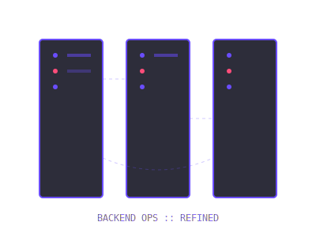

<!-- Header -->

  

  

<!-- Intro & Profile Image -->
<h3 style="color: #6A4DFF">👋 About Me</h3>

  <ul style="margin-top: 20px;">
    <li>🚀 <b style="color: #6A4DFF">Developer</b> dedicated to building multi-platform & scalable applications.</li>
    <li>📈 <b style="color: #6A4DFF">Continuous Growth</b>: 1% better every day through new challenges.</li>
    <li>⚡ Driven by <b style="color: #6A4DFF">efficiency</b> and creating <b style="color: #6A4DFF">product impact</b>.</li>
    <li>💡 Solving problems with <b style="color: #6A4DFF">innovative solutions</b> & modern tech.</li>
    <li>💜 <b style="color: #6A4DFF">Clean Code</b>, <b style="color: #6A4DFF">User Experience</b>, & <i>Purple Aesthetics</i>.</li>
  </ul>

  

 

<h3 style="color: #6A4DFF">🧠 Technical Philosophy</h3>

  

    Beyond core programming, I focus on <b style="color: #6A4DFF">how</b> software is built. For me, architecture and scalability aren't choices; they are requirements.
  

  

    I design <b style="color: #6A4DFF">RESTful APIs</b> and <b style="color: #6A4DFF">Mobile Apps</b> that are intuitive and robust, ensuring high performance across all layers. My focus on <b style="color: #6A4DFF">Clean Architecture</b> ensures that my code is future-proof.
  

  

 

---

### 🚀 Frontend & Mobile

  
  
  
  
  

### ⚙️ Backend & Systems

  
  
  
  
  
  
  

### 🗄️ Databases & Infrastructure

  
  
  
  
  
  
  
  

---

<h3 align="center">📊 GitHub Statistics</h3>

<table align="center" border="0" cellpadding="0" cellspacing="0" width="100%">
  <tr>
    <td width="50%" align="center">
      
    </td>
   <td width="50%" align="center">
      
    </td>
  </tr>
  <tr>
    <td colspan="2" align="center">
      
    </td>
  </tr>
</table>

  
  

